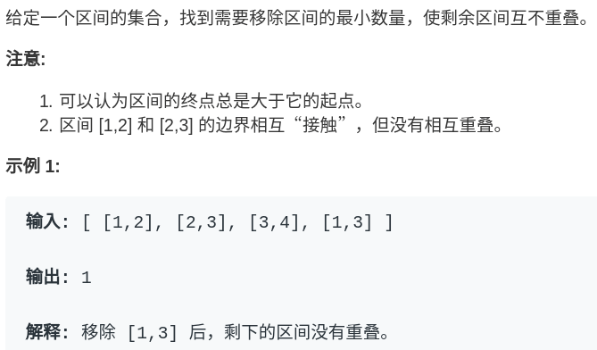

---
tags:
  - 动态规划
  - 贪心算法
---
# 贪心类型问题

## 贪心算法之区间调度问题

### 什么是贪心算法

什么是贪心算法呢？贪心算法可以认为是动态规划算法的一个特例，相比动态规划，使用贪心算法需要满足更多的条件（贪心选择性质），但是效率比动态规划要高。

比如说一个算法问题使用暴力解法需要指数级时间，如果能使用动态规划消除重叠子问题，就可以降到多项式级别的时间，如果满足贪心选择性质，那么可以进一步降低时间复杂度，达到线性级别的。

### 贪心选择性质
每一步都做出一个局部最优的选择，最终的结果就是全局最优。注意哦，这是一种特殊性质，其实只有一部分问题拥有这个性质。

然而，大部分问题明显不具有贪心选择性质。比如打斗地主，对手出对儿三，按照贪心策略，你应该出尽可能小的牌刚好压制住对方，但现实情况我们甚至可能会出王炸。这种情况就不能用贪心算法，而得使用动态规划解决，参见前文「动态规划解决博弈问题」。

### 一、问题描述

经典的贪心算法问题 Interval Scheduling（区间调度问题）：

给你很多形如 `[start, end]` 的闭区间，请你设计一个算法，**算出这些区间中最多有几个互不相交的区间**。

```java
int intervalSchedule(int[][] intvs) {}
```

举个例子，`intvs = [[1,3], [2,4], [3,6]]`，这些区间最多有 2 个区间互不相交，即 `[[1,3], [3,6]]`，你的算法应该返回 2。注意边界相同并不算相交。

这个问题在生活中的应用广泛，比如你今天有好几个活动，每个活动都可以用区间 `[start, end]` 表示开始和结束的时间，请问你今天**最多能参加几个活动呢？**显然你一个人不能同时参加两个活动，所以说这个问题就是求这些时间区间的最大不相交子集。

### 二、贪心算法

也许我们可以每次选择可选区间中开始最早的那个？但是可能存在某些区间开始很早，但是很长，使得我们错误地错过了一些短的区间。或者我们每次选择可选区间中最短的那个？或者选择出现冲突最少的那个区间？这些方案都能很容易举出反例，不是正确的方案。

#### 正确的思路

1. 从区间集合 intvs 中选择一个区间 x，这个 x 是在当前所有区间中**结束最早的**（end 最小）。
2. 把所有与 x 区间相交的区间从区间集合 intvs 中删除。
3. 重复步骤 1 和 2，直到 intvs 为空为止。之前选出的那些 x 就是最大不相交子集。

```java
public int intervalSchedule(int[][] intvs) {
    if (intvs.length == 0) return 0;
    // 按 end 升序排序
    Arrays.sort(intvs, new Comparator<int[]>() {
        public int compare(int[] a, int[] b) {
            return a[1] - b[1];
        }
    });
    // 至少有一个区间不相交
    int count = 1;
    // 排序后，第一个区间就是 x
    int x_end = intvs[0][1];
    for (int[] interval : intvs) {
        int start = interval[0];
        if (start >= x_end) {
            // 找到下一个选择的区间了
            count++;
            x_end = interval[1];
        }
    }
    return count;
}
```

### **三、应用举例**

#### LeetCode 第 435 题，无重叠区间：



我们已经会求最多有几个区间不会重叠了，那么剩下的不就是至少需要去除的区间吗？

```java
int eraseOverlapIntervals(int[][] intervals) {
    int n = intervals.length;
    return n - intervalSchedule(intervals);
}
```

### LeetCode 第 452 题，用最少的箭头射爆气球：


其实稍微思考一下，这个问题和区间调度算法一模一样！如果最多有 `n` 个不重叠的区间，那么就至少需要 `n` 个箭头穿透所有区间：


只是有一点不一样，在 `intervalSchedule` 算法中，如果两个区间的边界触碰，不算重叠；而按照这道题目的描述，箭头如果碰到气球的边界气球也会爆炸，所以说相当于区间的边界触碰也算重叠：

只是有一点不一样，在 `intervalSchedule` 算法中，如果两个区间的边界触碰，不算重叠；而按照这道题目的描述，箭头如果碰到气球的边界气球也会爆炸，所以说相当于区间的边界触碰也算重叠：

所以只要将之前的算法稍作修改，就是这道题目的答案：

```java
int findMinArrowShots(int[][] intvs) {
    // ...
    for (int[] interval : intvs) {
        int start = interval[0];
        // 把 >= 改成 > 就行了
        if (start > x_end) {
            count++;
            x_end = interval[1];
        }
    }
    return count;
}
```

这么做的原因也不难理解，因为现在边界接触也算重叠，所以 `start == x_end` 时不能更新 x。

## 扫描线技巧：安排会议室

力扣第 253 题 **[会议室 II](https://leetcode.cn/problems/meeting-rooms-ii/)**

给你输入若干形如 `[begin, end]` 的区间，代表若干会议的开始时间和结束时间，请你计算至少需要申请多少间会议室。

函数签名如下：

```java
// 返回需要申请的会议室数量
int minMeetingRooms(int[][] meetings);
```

**如果把每个会议的起始时间看做一个线段区间，那么题目就是让你求最多有几个重叠区间**

对于这种时间安排的问题，本质上讲就是区间调度问题，十有八九得排序，然后找规律来解决。****

### ****题目延伸****

- **第一个场景**，假设现在只有一个会议室，还有若干会议，你如何将尽可能多的会议安排到这个会议室里？
  这个问题需要将这些会议（区间）按结束时间（右端点）排序，然后进行处理，详见前文 [贪心算法做时间管理](https://cloud.tencent.com/developer/tools/blog-entry?target=http://mp.weixin.qq.com/s?__biz=MzAxODQxMDM0Mw==&mid=2247485087&idx=2&sn=e74bdfdae607939a169295f7f95eff7a&chksm=9bd7f897aca071814fc20fe6915c9d99debeeebffa49dda8bad79fee720738c0b1b2de3ea762&scene=21#wechat_redirect)。
- **第二个场景**，给你若干较短的视频片段，和一个较长的视频片段，请你从较短的片段中尽可能少地挑出一些片段，拼接出较长的这个片段。
  这个问题需要将这些视频片段（区间）按开始时间（左端点）排序，然后进行处理，详见前文 [剪视频剪出一个贪心算法](https://cloud.tencent.com/developer/tools/blog-entry?target=http://mp.weixin.qq.com/s?__biz=MzAxODQxMDM0Mw==&mid=2247491102&idx=1&sn=755633b7d225970135cd6c8b2f500a27&chksm=9bd7e016aca0690025a1cf54812732ac1042fda44eacf1284371236b62d484eeee80b5d70537&scene=21#wechat_redirect)。
- **第三个场景**，给你若干区间，其中可能有些区间比较短，被其他区间完全覆盖住了，请你删除这些被覆盖的区间。
  这个问题需要将这些区间按左端点排序，然后就能找到并删除那些被完全覆盖的区间了，详见前文 [删除覆盖区间](https://cloud.tencent.com/developer/tools/blog-entry?target=http://mp.weixin.qq.com/s?__biz=MzAxODQxMDM0Mw==&mid=2247487316&idx=1&sn=95cfbbd24f1cb5d8c07c71c2ba15246a&chksm=9bd7f15caca0784ab7bce7f36a6eb9118de2a573515a99948168ed93b25069a3b7bf85cf50a5&scene=21#wechat_redirect)。
- **第四个场景**，给你若干区间，请你将所有有重叠部分的区间进行合并。
  这个问题需要将这些区间按左端点排序，方便找出存在重叠的区间，详见前文 [合并重叠区间](https://cloud.tencent.com/developer/tools/blog-entry?target=http://mp.weixin.qq.com/s?__biz=MzAxODQxMDM0Mw==&mid=2247487316&idx=1&sn=95cfbbd24f1cb5d8c07c71c2ba15246a&chksm=9bd7f15caca0784ab7bce7f36a6eb9118de2a573515a99948168ed93b25069a3b7bf85cf50a5&scene=21#wechat_redirect)。
- **第五个场景**，有两个部门同时预约了同一个会议室的若干时间段，请你计算会议室的冲突时段。
  这个问题就是给你两组区间列表，请你找出这两组区间的交集，这需要你将这些区间按左端点排序，详见前文 [区间交集问题](https://cloud.tencent.com/developer/tools/blog-entry?target=http://mp.weixin.qq.com/s?__biz=MzAxODQxMDM0Mw==&mid=2247487316&idx=1&sn=95cfbbd24f1cb5d8c07c71c2ba15246a&chksm=9bd7f15caca0784ab7bce7f36a6eb9118de2a573515a99948168ed93b25069a3b7bf85cf50a5&scene=21#wechat_redirect)。
- **第六个场景**，假设现在只有一个会议室，还有若干会议，如何安排会议才能使这个会议室的闲置时间最少？
  这个问题需要动动脑筋，说白了这就是个 0-1 背包问题的变形：
  会议室可以看做一个背包，每个会议可以看做一个物品，物品的价值就是会议的时长，请问你如何选择物品（会议）才能最大化背包中的价值（会议室的使用时长）？
  当然，这里背包的约束不是一个最大重量，而是各个物品（会议）不能互相冲突。把各个会议按照结束时间进行排序，然后参考前文 [0-1 背包问题详解](https://cloud.tencent.com/developer/tools/blog-entry?target=http://mp.weixin.qq.com/s?__biz=MzAxODQxMDM0Mw==&mid=2247491184&idx=2&sn=8893a65d23d92c3b18c7abf62c2e88ba&chksm=9bd7e078aca0696e2352d1c60bff9182969983712664e2e94450d8206a47f260b65ac63ec828&scene=21#wechat_redirect) 的思路即可解决，等我以后有机会可以写一写这个问题。
- **第七个场景**，就是本文想讲的场景，给你若干会议，让你合理申请会议室。
  好了，举例了这么多，来看看今天的这个问题如何解决。

### 题目分析

**给你输入若干时间区间，让你计算同一时刻「最多」有几个区间重叠**。

题目的关键点在于，给你任意一个时刻，你是否能够说出这个时刻有几个会议在同时进行？

如果可以做到，那我遍历所有的时刻，找个最大值，就是需要申请的会议室数量。

有没有一种数据结构或者算法，给我输入若干区间，我能知道每个位置有多少个区间重叠？

老读者肯定可以联想到之前说过的一个算法技巧：[差分数组技巧](https://cloud.tencent.com/developer/tools/blog-entry?target=http://mp.weixin.qq.com/s?__biz=MzAxODQxMDM0Mw==&mid=2247487011&idx=1&sn=5e2b00c1c736fd7afbf3ed35edc4aeec&chksm=9bd7f02baca0793d569a9633cc14117e708ccc9eb41b7f0add430ea78f22e4f2443f421c6841&scene=21#wechat_redirect)。

把时间线想象成一个初始值为 0 的数组，每个时间区间`[i, j]`就相当于一个子数组，这个时间区间有一个会议，那我就把这个子数组中的元素都加一。

最后，每个时刻有几个会议我不就知道了吗？我遍历整个数组，不就知道至少需要几间会议室了吗？

举例来说，如果输入`meetings = [[0,30],[5,10],[15,20]]`，那么我们就给数组中`[0,30],[5,10],[15,20]`这几个索引区间分别加一，最后遍历数组，求个最大值就行了。

还记得吗，差分数组技巧可以在 O(1) 时间对整个区间的元素进行加减，所以可以拿来解决这道题。

不过，这个解法的效率不算高，所以我这里不准备具体写差分数组的解法，参照 [差分数组技巧](https://cloud.tencent.com/developer/tools/blog-entry?target=http://mp.weixin.qq.com/s?__biz=MzAxODQxMDM0Mw==&mid=2247487011&idx=1&sn=5e2b00c1c736fd7afbf3ed35edc4aeec&chksm=9bd7f02baca0793d569a9633cc14117e708ccc9eb41b7f0add430ea78f22e4f2443f421c6841&scene=21#wechat_redirect) 的原理，有兴趣的读者可以自己尝试去实现。

**基于差分数组的思路，我们可以推导出一种更高效，更优雅的解法**。

我们首先把这些会议的时间区间进行投影：


红色的点代表每个会议的开始时间点，绿色的点代表每个会议的结束时间点。

现在假想有一条带着计数器的线，在时间线上从左至右进行扫描，每遇到红色的点，计数器`count`加一，每遇到绿色的点，计数器`count`减一：


**这样一来，每个时刻有多少个会议在同时进行，就是计数器`count`的值，`count`的最大值，就是需要申请的会议室数量**。

对差分数组技巧熟悉的读者一眼就能看出来了，这个扫描线其实就是差分数组的遍历过程，所以我们说这是差分数组技巧衍生出来的解法。

### 代码实现

首先，对区间进行投影，就相当于对每个区间的起点和终点分别进行排序：


```java
int minMeetingRooms(int[][] meetings) {
    int n = meetings.length;
    int[] begin = new int[n];
    int[] end = new int[n];
    // 把左端点和右端点单独拿出来
    for(int i = 0; i < n; i++) {
        begin[i] = meetings[i][0];
        end[i] = meetings[i][1];
    }
    // 排序后就是图中的红点
    Arrays.sort(begin);
    // 排序后就是图中的绿点
    Arrays.sort(end);

    // ...
}
```

然后就简单了，扫描线从左向右前进，遇到红点就对计数器加一，遇到绿点就对计数器减一，计数器`count`的最大值就是答案：

```java
int minMeetingRooms(int[][] meetings) {
    int n = meetings.length;
    int[] begin = new int[n];
    int[] end = new int[n];
    for(int i = 0; i < n; i++) {
        begin[i] = meetings[i][0];
        end[i] = meetings[i][1];
    }
    Arrays.sort(begin);
    Arrays.sort(end);

    // 扫描过程中的计数器
    int count = 0;
    // 双指针技巧
    int res = 0, i = 0, j = 0;
    while (i < n && j < n) {
        if (begin[i] < end[j]) {
            // 扫描到一个红点
            count++;
            i++;
        } else {
            // 扫描到一个绿点
            count--;
            j++;
        }
        // 记录扫描过程中的最大值
        res = Math.max(res, count);
    }

    return res;
}
```

这里使用的是 [双指针技巧](https://cloud.tencent.com/developer/tools/blog-entry?target=http://mp.weixin.qq.com/s?__biz=MzAxODQxMDM0Mw==&mid=2247488584&idx=1&sn=90f7956fd9d8320fcb81aaf33c3fe7f1&chksm=9bd7ea40aca06356cdb87ba86518c50646b48b8534d42625ba454c084187400b979c8d736a61&scene=21#wechat_redirect)，你可以认为指针 i 就是那根扫描线，根据`i, j`的相对位置就可以模拟扫描线前进的过程。

至此，这道题就做完了。当然，这个题目也可以变形，比如给你若干会议，问你`k`个会议室够不够用，其实你套用本文的解法代码，也可以很轻松解决。

#@ ****剪视频剪出一个贪心算法****

力扣第 1024 题「视频拼接」


函数签名如下：

```java
int videoStitching(int[][] clips, int T);
```

### 思路分析

**区间问题肯定按照区间的起点或者终点进行排序。**因为排序之后更容易找到相邻区间之间的联系，如果是求最值的问题，可以使用贪心算法进行求解。

至于到底如何排序，这个就要因题而异了，我做这道题的思路是先按照起点升序排序，如果起点相同的话按照终点降序排序。

为什么这样排序呢，主要考虑到这道题的以下两个特点：

1、要用若干短视频凑出完成视频`[0, T]`，至少得有一个短视频的起点是 0。

这个很好理解，如果没有一个短视频是从 0 开始的，那么区间`[0, T]`肯定是凑不出来的。

2、如果有几个短视频的起点都相同，那么一定应该选择那个最长（终点最大）的视频。

这一条就是贪心的策略，因为题目让我们计算最少需要的短视频个数，如果起点相同，那肯定是越长越好，不要白不要，多出来了大不了剪辑掉嘛。


当我们确定`clips[0]`一定会被选择之后，就可以选出第二个会被选择的视频：


**我们会比较所有起点小于`clips[0][1]`的区间，根据贪心策略，它们中终点最大的那个区间就是第二个会被选中的视频**。

然后可以通过第二个视频区间贪心选择出第三个视频，以此类推，直到覆盖区间`[0, T]`，或者无法覆盖返回 -1。

### 代码实现

实现上述思路需要我们用两个变量`curEnd`和`nextEnd`来进行：


```java
int videoStitching(int[][] clips, int T) {
    if (T == 0) return 0;
    // 按起点升序排列，起点相同的降序排列
    Arrays.sort(clips, (a, b) -> {
        if (a[0] == b[0]) {
            return b[1] - a[1];
        }
        return a[0] - b[0];
    });
    // 记录选择的短视频个数
    int res = 0;

    int curEnd = 0, nextEnd = 0;
    int i = 0, n = clips.length;
    while (i < n && clips[i][0] <= curEnd) {
        // 在第 res 个视频的区间内贪心选择下一个视频
        while (i < n && clips[i][0] <= curEnd) {
            nextEnd = Math.max(nextEnd, clips[i][1]);
            i++;
        }
        // 找到下一个视频，更新 curEnd
        res++;
        curEnd = nextEnd;
        if (curEnd >= T) {
            // 已经可以拼出区间 [0, T]
            return res;
        }
    }
    // 无法连续拼出区间 [0, T]
    return -1;
}
```

这段代码的时间复杂度是多少呢？虽然代码中有一个嵌套的 while 循环，但这个嵌套 while 循环的时间复杂度是`O(N)`。因为当`i`递增到`n`时循环就会结束，所以这段代码只会执行`O(N)`次。

但是别忘了我们对`clips`数组进行了一次排序，消耗了`O(NlogN)`的时间，所以本算法的总时间复杂度是`O(NlogN)`。

## 如何运用贪心思想玩跳跃游戏

### LeetCode 第 55 题 跳跃游戏I


**不知道读者有没有发现，有关动态规划的问题，大多是让你求最值的**，比如最长子序列，最小编辑距离，最长公共子串等等等。这就是规律，因为动态规划本身就是运筹学里的一种求最值的算法。

那么贪心算法作为特殊的动态规划也是一样，也一定是让你求个最值。这道题表面上不是求最值，但是可以改一改：

**请问通过题目中的跳跃规则，最多能跳多远**？如果能够越过最后一格，返回 true，否则返回 false。

所以说，这道题肯定可以用动态规划求解的。但是由于它比较简单，下一道题再用动态规划和贪心思路进行对比，现在直接上贪心的思路：

```java
bool canJump(vector<int>& nums) {
    int n = nums.size();
    int farthest = 0;
    for (int i = 0; i < n - 1; i++) {
        // 不断计算能跳到的最远距离
        farthest = max(farthest, i + nums[i]);
        // 可能碰到了 0，卡住跳不动了
        if (farthest <= i) return false;
    }
    return farthest >= n - 1;
}
```

你别说，如果之前没有做过类似的题目，还真不一定能够想出来这个解法。每一步都计算一下从当前位置最远能够跳到哪里，然后和一个全局最优的最远位置 `farthest` 做对比，通过每一步的最优解，更新全局最优解，这就是贪心。

### LeetCode 第 45 题 跳跃游戏II


**现在的问题是，保证你一定可以跳到最后一格，请问你最少要跳多少次，才能跳过去**。

我们先来说说动态规划的思路，采用自顶向下的递归动态规划，可以这样定义一个 `dp` 函数：

```java
// 定义：从索引 p 跳到最后一格，至少需要 dp(nums, p) 步
int dp(vector<int>& nums, int p);
```

我们想求的结果就是 `dp(nums, 0)`，base case 就是当 `p` 超过最后一格时，不需要跳跃：

```java
if (p >= nums.size() - 1) {
    return 0;
}
```

根据前文 [动态规划套路详解](https://labuladong.gitbook.io/algo) 的动规框架，就可以暴力穷举所有可能的跳法，通过备忘录 `memo` 消除重叠子问题，取其中的最小值最为最终答案：

```java
vector<int> memo;
// 主函数
int jump(vector<int>& nums) {
    int n = nums.size();
    // 备忘录都初始化为 n，相当于 INT_MAX
    // 因为从 0 调到 n - 1 最多 n - 1 步
    memo = vector<int>(n, n);
    return dp(nums, 0);
}

int dp(vector<int>& nums, int p) {
    int n = nums.size();
    // base case
    if (p >= n - 1) {
        return 0;
    }
    // 子问题已经计算过
    if (memo[p] != n) {
        return memo[p];
    }
    int steps = nums[p];
    // 你可以选择跳 1 步，2 步...
    for (int i = 1; i <= steps; i++) {
        // 穷举每一个选择
        // 计算每一个子问题的结果
        int subProblem = dp(nums, p + i);
        // 取其中最小的作为最终结果
        memo[p] = min(memo[p], subProblem + 1);
    }
    return memo[p];
}
```

这个动态规划应该很明显了，按照前文 [动态规划套路详解](https://labuladong.gitbook.io/algo) 所说的套路，状态就是当前所站立的索引 `p`，选择就是可以跳出的步数。

该算法的时间复杂度是 递归深度 × 每次递归需要的时间复杂度，即 O(N^2)，在 LeetCode 上是无法通过所有用例的，会超时。

**贪心算法比动态规划多了一个性质：贪心选择性质**。我知道大家都不喜欢看严谨但枯燥的数学形式定义，那么我们就来直观地看一看什么样的问题满足贪心选择性质。

```java
int steps = nums[p];
    // 你可以选择跳 1 步，2 步...
    for (int i = 1; i <= steps; i++) {
        // 计算每一个子问题的结果
        int subProblem = dp(nums, p + i);
        res = min(subProblem + 1, res);
    }
```

for 循环中会陷入递归计算子问题，这是动态规划时间复杂度高的根本原因。

但是，真的需要【递归地】计算出每一个子问题的结果，然后求最值吗？**直观地想一想，似乎不需要递归，只需要判断哪一个选择最具有【潜力】即可**：


比如上图这种情况，我们站在索引 0 的位置，可以向前跳 1，2 或 3 步，你说应该选择跳多少呢？

**显然应该跳 2 步调到索引 2，因为 `nums[2]` 的可跳跃区域涵盖了索引区间 `[3..6]`，比其他的都大**。如果想求最少的跳跃次数，那么往索引 2 跳必然是最优的选择。

你看，**这就是贪心选择性质，我们不需要【递归地】计算出所有选择的具体结果然后比较求最值，而只需要做出那个最有【潜力】，看起来最优的选择即可**。

```java
int jump(vector<int>& nums) {
    int n = nums.size();
    int end = 0, farthest = 0;
    int jumps = 0;
    for (int i = 0; i < n - 1; i++) {
        farthest = max(nums[i] + i, farthest);
        if (end == i) {
            jumps++;
            end = farthest;
        }
    }
    return jumps;
}
```

结合刚才那个图，就知道这段短小精悍的代码在干什么了：


`i` 和 `end` 标记了可以选择的跳跃步数，`farthest` 标记了所有选择 `[i..end]` 中能够跳到的最远距离，`jumps` 记录了跳跃次数。

本算法的时间复杂度 O(N)，空间复杂度 O(1)，可以说是非常高效，动态规划都被吊起来打了。