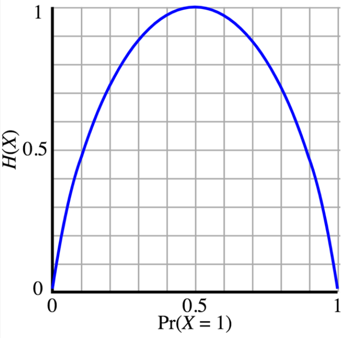
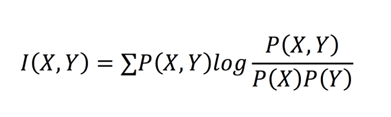
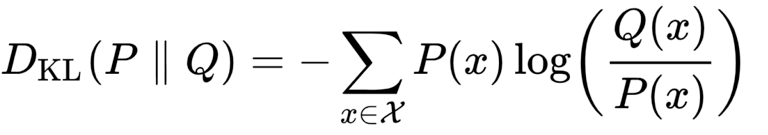

# 信息论
作者：吴军
## 信息时代每个人的必修课

- 信息时代最大的特征是不确定性
- 从未知到确定到不确定
- 利用信息消除不确定性
- 三种能力
  - 在面对大量信息时，排除噪音，提取利用有效信息，科学做决策的能力
  - 向外界传递信息，平衡分配有限资源，增加沟通带宽，放大影响力的能力
  - 看懂信息应用的逻辑和通信发展的趋势，提前抓住新机遇的能力
- 一个人的思维方式和做事方法决定了一个人能够走多远，而在历史的任何时期，都有最适合时代的方法论
- 世界上任何一个探索者都需要清楚三件事：我们现在的位置，我们的目标，以及通向目标的道路

## 影响世界的三比特信息

1. 二战，佐尔格关于日本军部北进还是南下的战略决策
2. 1944年，盟军登陆地点
3. 公元前262—260年的秦赵长平之战，秦国隐藏了“白起为将”，赵括只会纸上谈兵，自大，信息缺失，不知道对方的主帅是谁

------

- 不要重视钱而轻视信息

- 根据信息论对信息量单位比特的定义，如果存在两种情况，它们出现的可能性相同，都是50%，这时要消除其不确定性所需要的信息是1比特。但是如果一种情况发生的可能性大，另一种发生的可能性小，所需要的信息就不到1比特。

  > 比如说，一种情况出现的概率是1/3，另一种是2/3，这种情况下消除不确定性的信息量则降低到0.9比特。在更极端的情况下，比如一种情况有99%的可能性发生，另一种是1%，那么这时的不确定性只有0.08比特了。

- 信息量和不确定性有关，公众都知道的信息，其实是没有信息量的

- 用很少的信息驱动很大的能量

- 对一个未知系统（黑盒子）所做出的估计和真实情况的偏离，就是信息的损失，偏离越多损失越大。

## 解开世界之谜的三篇诺贝尔奖论文

1. 宇宙如何诞生-两页纸的论文-1964年，贝尔实验室的工程师阿诺·彭齐亚斯和罗伯特·威尔逊在无意中发现了宇宙背景辐射。人类后来又根据背景辐射的温度，以及扩张的速度等信息，倒推出宇宙有138亿年的历史。
2. 生命起源和传承-DNA-沃森和克里克的双螺旋模型，利用能够看到的信息，解释看不到的信息。（奥卡姆剃刀原则）
3. G蛋白-世界上1/3到一半的药物靶标都和G蛋白有关。控制生命活动的信息，其实并不被我们主观控制，但是我们可以发现它们。

------

- 一篇好的论文，一方面需要信息量高，另一方面需要在信息传播上效率高。大家都读不懂的论文，信息传递的效率就低。
- 要精简，要保证对方听懂自己最核心的想法，这就够了。我阅读过几十篇的诺贝尔奖的论文，很少有超过10页纸的。

## 大数据思维的科学基础

- 大数据的关键是思维方式的变化
- 大数据应用
  - 解决人工智能问题，把过去那些看似需要人脑推理的问题，变成今天基于大数据的计算问题
    - 语音识别 ⇒ 通讯问题，香农信息论
    - 机器翻译
  - 利用大数据，进行精准的服务
    - 尽可能多的数据
    - 对行为习惯和偏好类似的人进行聚类
  - 动态调整我们做事情的策略
    - **机械论的思维方式**：通过找到通用的规律试图一劳永逸地解决问题
    - 今天容易一劳永逸解决的那些问题已经被解决了，留给我们的是不确定的问题，因此我们做事情的策略也就要变化了
    - 如果有了足够多的数据，是否在理论上有保障，只要调整的次数足够多，就能收到最佳匹配呢？答案是肯定的。
  - 发现原来不知道的规律
    - 让处方药和各种疾病重新匹配

## 信息度量：世界上有稳赚不赔的生意吗

- 对于一条信息，重要的是找出其中有多少信息量，要搞清楚“信息量”，就要对信息进行量化的度量

- 度量信息量的基本单位：比特（香农）

- 信息源：充满不确定性的黑盒子

- 信息熵：黑盒子里面的不确定性

  - $H=-P1logP1-P2logP2-P3logP3-...-PnlogPn$

  

- 信息：用来消除信息熵

- 要搞清楚黑盒子里是怎么一回事，需要的信息量就等于黑盒子的信息熵

- 一个系统中的状态数量，也就是可能性，越多，不确定性就越大；在状态数量保持不变时，如果各个状态的可能性相同，不确定性就很大；相反，如果个别状态容易发生，大部分状态都不可能发生，不确定性就小。

- 永远不要听那些正确率总是50%的专家的建议，因为那相当于什么都没说，没有提供能够减少“信息熵”的“信息量”

- 开赌局的从来不是拿自家的钱和你对赌，而是让你们彼此互相赌，他通过变相多收费盈利

- 很多交易和产品都是利用了信息的可度量性

- 信息量的大小不在于长短，而在于开创了多少新知

- 心灵鸡汤大家不愿意读，并非是它们说的不对，而是没有信息量。

## 信息编码：数字和文字是如何诞生的

1. 一一对应
2. 采用十进制编码，用10中符号
3. 二进制编码

------

- 对数字的各种编码其实是等价的，无非是平衡编码复杂性和编码长度的关系
- 在一个编码系统中解决不了的问题，换一个系统同样解决不了
- 香农第一定律：编码长度≥信息熵（信息量）/每一个码的信息量
- 人类使用动词，标志着文明的一大进步，这不仅意味着他们能够把动作进行分类，编码了，而且这样才能表达复杂的意思，才有可能形成知识。
- 在任何历史阶段，谁控制了信息，谁就是世界的主人

## 有效编码：10个手指能表示多少个数字

- 好的编码的第一个特点就是要便于区分不同的信息
- 原则
  - 明确：沟通的核心
  - 诚实：沟通的基础。口是心非，难免语焉不详。
  - 勇气：代表对一件事的态度
  - 责任：对一件事要有所谓，如果对一件事持无所谓的态度，说出来的话就一天一个样
- 信息编码的基本原则
  - 易识别
  - 有效
    - 在信息传播上，只有当编码有效时才能在短时间里传递大量的信息。
    - 组合信息，保证高效传递且不违背第一条“易辨识”的原则
- 让理论最佳值在应用中落地
- 知识学习了之后只有真正使用了，才能变成自己的东西。学以致用比多学习更重要。

## 最短编码：如何利用哈夫曼编码原理投资

- 哈夫曼编码三个要点
  - 由香农第一定律：编码长度有理论的最小值⇒哈夫曼编码是最优化的
  - 将最宝贵的资源（最短的编码）给出现概率最大的信息，一条信息编码的长度和出现概率的对数成正比
  - 在现实生活中，有很多信息的组合，比单独一条信息，其概率分布差异更大，因此对它们使用哈夫曼编码进行信息压缩，压缩比会更高。
- 靠一整套系统的方法，保证投资的成功率
- 通过一次双倍砸钱，把最多的钱投入最容易成功的项目上
- 按照哈夫曼编码的原理，可以先把钱分成几部分逐步投入下去，每一次投资的公司呈指数减少，而金额倍增。具体操作方法如下：
  - 第一轮，选择100家公司，每家投入25万美元，这样用掉2500万美元。
  - 第二轮，假定有1/3的公司即33家表现较好，每家再投入75万美元左右，也用掉2500万美元。至于剩下了的2/3已经死掉或者不死不活的公司，千万不要救它们，更不要觉得便宜去抄底。
  - 第三轮，假定1/10的公司，即10家表现较好，每家投入250万美元，再用掉2500万美元。
  - 第四轮，假定3%的公司，即3家表现较好，每家投入800万美元左右，用掉最后的2500万美元
- 美国有名的私立学校哈克学校的前校长尼克诺夫博士讲，在孩子小时候，要让他们尝试各种兴趣爱好，但是最终他们要在一个点上实现突破，他将这比做用圆规画圆，一方面有一个扎得很深的中心，另一方面有足够广的很浅的覆盖面。
- 对于花了一些精力，看样子做不成的事情，我是坚决做减法止损

## 矢量化：象形文字和拼音文字是如何演化的

- 人类象形文字的演化，就是矢量化的过程
- 在信息论中，一个更普遍的问题是，矢量化会带来多大的信息损失
- 在工程中要做的事就是，如何平衡便利性和矢量化的损失。人在年轻的时候，总是会想两者兼而有之，学习了各种科学知识之后，就知道这种事情在理论上是办不到的。
- 我们进而讲述了，无论是象形文字还是天然形成的拼音文字，都通过两到三个维度的矢量化兼顾了读音和达意的关系。但是，如果强制将中文拼音化，它将失去达意的功能，这不符合信息论的原则，因此做不下去。世界上人为想做的，但违背规律的事情，做起来总是困难重重。
- 在生活中其实也有很多矢量化的例子，它们让问题变得简单，但是会丢失信息，而平衡便利性和信息的完整性，就成为了艺术。

## 冗余度：《史记》和《圣经》哪个信息量大

- 用冗余度描述信息的密集和稀疏程度
- 冗余度=（信息的编码长度-一条信息的信息量）/信息的编码长度
- 如果冗余度太低，会影响信息的接收速度
- 冗余度的好处
  - 便于理解
  - 消除歧义性
  - 带来信息的容错性
- 冗余度的问题
  - 存储和传递信息时的浪费
  - 如果在信息中混有噪音，过多没用的信息会导致错误
- 善用信息冗余会帮助我们成为沟通的高手
  - 讲东西时要通过加入一些看似废话，但是实际上是从侧面诠释你想法的句子，帮助对方理解你的意思。“换句话说”，“比如说”，“从另一方面讲”
  - 讲东西要有一致性，不要补充有可能和主题思想相矛盾的例子，或与想法无关的冗余信息。
  - 我们脑子在存储信息时，要进行压缩，这样脑子才记得住事情。做类似于写卡片的事情，把一本厚厚的书，变成几页纸，删掉冗余的信息。我有时讲，读书要不求甚解。这不是说不读懂，而是说要读出主线，将一些细节过滤掉。真到了需要寻找细节时，大不了回过头来再看看就好了。

## 等价性：信息是如何压缩的

- 傅里叶变换
- 今天我们见到的各种音频信号，包括我们的语音、音乐等等，在较短的时间内，都有相对稳定的周期性，比如下图就是一段语音，你可以看出它有一定的周期性。利用傅立叶变换，可以对语音进行压缩编码，然后传输，这样可以将语音信息压缩10倍左右，当然这样可能会有很少的信息损失，这一点我们后面再讲。但不管怎样，这样的信息压缩是非常合算的，比如用微信语音打电话，如果不进行信息压缩，可能要多用十倍的数据流量。
- 这其实只是我们在宏观上看一幅图，但是如果我们用放大镜把图放得特别大，看到的就是一个个像素，而且相邻的像素之间颜色和灰度的变化会是相对连续的。利用这个特性，人们发明了一种被称为“离散余弦变换”的数学工具，也称为DCT。
- 善用等价信息，是我们这个年代每一个人都必须掌握的工作技巧，这是我们这讲最希望你记住的一个知识点。比如说我们无法看清人体内部的情况，但是我们知道人体内有很多水分，水里有氢原子，它的电子在旋转中形成一个个微小的磁针，我们在人体外面施加磁场，就可以把水分子里的小磁针方向给排顺了，然后我们加入一个能够和水中氢原子共振的脉冲，就可以把人体氢原子振动的信息取
- 出来。由于人体各个部分水的分布不一样，我们通过各个部分氢原子振动的信息，就可以把人的结构画出来。这就是核磁共振的原理。因此核磁共振就是利用了等价信息。

## 信息增量：信息压缩中的保守主义原则

- 为了防止这样编码造成的累积误差，也为了防止中间有一点点信息损失，后面的视频统统打不开，所以，每过若干帧，我们就要重新产生一个主帧，以免错误会传递太远。
- 我们在过去的专栏里讲了保守主义的做事态度，他的好处其实又我们这个世界渐变的特征决定的。因此，在绝大多数时候，我们不需要推倒重来，只需要对变化进行一些修补就好了。
- 如果想一次完成巨大的突变，通常会因为牵扯的利益太多，最后总是搁浅，永远改变不了，最后反而是不进步
- 这就如同我们如果非要对一个2小时的电影每一帧都保留全部的信息，那么一部电影的数据会大得在网络上无法传输，我们的计算机播放电影就会不断卡壳，我们看到的画面反而不如压缩的清楚。

## 压缩比和失真率：如何在信息取舍之间做平衡？

- 香农指出，任何编码的长度都不会小于信息熵，也就是通常会大于等于信息熵，当然最理想的就是能等于。
- 如果编码长度太短，小于信息熵，就会出现信息失真。
- 世界上很多时候没有更好的技术方案，只能根据场合找到合适的，因此做事情的目的性很重要，这是第一个原则
- 信息的作用是消除不确定性，那么放过来，丢失了一部分信息，一定会增加不确定性。用的信息少，永远不可能做得和原来一样好，这是第二个原则。
- 第三个原则是，在压缩信息时，有时要看场景
- 任何与众不同的信息，总是先被压缩掉，因为对那些与众不同的东西做编码，占用的空间相对太多。

## 信息正交性：在信息很多的情况下如何做决策

- 信息和能量有一定的相关性，但是他们的性质完全不同，比如信息不具有守恒的特点。你将一条信息告诉别人，你自己并不损失这条信息。
- 和能量不同，相同的信息使用两次，不会产生两倍的效果。
- 在利用多种信息消除不确定性时，所采用的信息是正交的。
- 在实际工作中，绝大部分时候，如果每一种信息可以减少1%的错误，两种合在一起能够产生1.2%就不算失败，能够到1.5%就非常满意了。这也说明寻找正交信息不容易。
- 找正交信息的方法
  - 不同的信息要来自不同的信息源
  - 避免反复使用相互嵌套或者相互包含的信息
  - 看问题要刻意改变一下观察的角度，从不同的角度出发
- 在多种信息源中，如何选取几种重要而且彼此尽可能正交的信息
  - 不断叠加
  - 不断删除

## 互信息：相关不是因果，那相关是什么

- 相关不是因果，其实世界上大多数联系都是相互联系，而不是因果关系。相关的联系可以强，可以弱，但弱相关其实没有什么意义。我们需要寻找和利用的是强相关性。
- 互信息：量化度量各种不同信息相关性

- 世界上有很多东西彼此相关，如果他们之间有确定的因果关系，那样的信息就是等价的。比如从A一定能知道B，那么知道了A就等同知道了B。
- 世界上大部分相关的信息未必有因果关系，他们之间只是一种动态的相互关联的关系。比如A发生了，B的相关性就增加，这就是相关性。如果相关性比较强，我们在得到了A的信息之后，就可以消除B的不确定性。
- 使用相关性主义不要把因果关系搞反了。即使可以由A得到B，但是B未必能够反过来确定A。很强的互信息总让人想到因果关系，但是谁是因，谁是果，都要花点心思搞清楚。
- 专业人士可能会因为掌握专业工具，做得比业余人士要好。

## 条件熵和信息增益：你提供的信息到底值多少钱

- 条件熵：H(X|Y)
- 真正能够通过投资股票挣钱的人，是不会告诉你所谓投资秘诀的
- 因为最有效的信息已经被发现了，剩下来留给大家的微乎其微。
- 通常，人们总是率先发现和所要解决问题互信息最大的信息，也就是增益最大的信息，因此通常来讲，越往后发现的信息，带来的增益越小。世界上的股市已经被人研究了几百年，各种直观的能够预测股市的有用信号已经被挖掘殆尽。
- 一条信息的价值，取决于这条信息对未知系统所带来的信息增益。两台信息，先出现的价值更大，第二条的价值就小，在数学上可以证明这一点。当然如果两条信息正交，那第二条依然像过去一样有价值。
- 第一个说出看法的，常常就成为了意见领袖，跟着发表看法的，大家其实记不住。

## 置信度：马斯克犯了什么数学错误

- 置信度：你有多大的把握说钢镚不均匀，正面朝上的概率更大，这个把握就是置信度。
- T-测试
- 提高置信度：增加所统计的样本的数量
- 人们在对待信息时通常犯的一个错误，就是忽视它的置信度，以至于我们把完全随机的事情，当成必然的事情。
- 对于能够重复的事情，要被检验足够多次之后，置信度才高

## 交叉熵：如何避免制定出与事实相反的计划

- 交叉熵的公式

- 如果你的猜测和真实情况完全一致，你不损失任何东西，但是只要猜测和真实情况不一致，就会或多或少有损失。
- 你的猜测和真实情况相差越大，损失越大。
- 自大的人非常容易遗漏很多原本应该考虑的事情，赵括如此，后来的马谡也是如此
- 过分防范各种情况，患得患失，是否有损失呢？这里的答案也是肯定的
- 在信息论中，任何硬性的决定（hard decision）都要损失信息。
  - 今天做人工智能的人都有这样一个经验，在走到最后一步之前，最好多保留一些可能性，哪怕将那些可能性的权重设得非常低，而不要很早就硬性地作决定，因为在硬性决定后失去的信息是永远也补不回来的。

## 复盘：如何识别误导人的错误信息

- 掌握准确信息的好处我们不多说了，特别是当别人得到的信息是片面的、支离破碎的，而你掌握的信息是准确全面的时候，你的优势是巨大的。
- 误导人的信息特征
  - 刻意要引起你注意的人，常常会用耸人听闻的信息打动你
  - 没有出处
  - 缺乏上下文
- 三个方法
  - 将它们放在更大的时空来考量
  - 要看信息的一致性
  - 对于从一大堆信息中抽取的信息，要看他们的失真率
- 五个重要原则
  - 最好、最重要的资源要用于那些出现最频繁的事情，这样分配资源最有效，其背后的原理是香农第一定律和霍夫曼编码
  - 不要将相关性当成因果关系。弱相关性对我们做事情没有帮助，而对于强相关性，要搞清楚谁可能是因，谁可能是果，切忌因果倒置。
  - 我们很多时候，要直接获得某种信息是很困难的，因此可以通过获得等价信息，得到同样的效果。
  - 我们日常遇到的大部分事情，都是渐变的，因此通过增量改进，要比推倒重来效率更高，这就如同对增量压缩，可以比静态压缩高很多一样。
  - 由于我们遇到的信息很多，一个比较高效率表示信息的方式是矢量化，也就是将很多维度的信息映射到我们关心的几个维度。我们用到的例子是：文字的演变就是矢量化的结果。
- 关注
  - 信息熵
  - 冗余度
  - 正交性

## 模块一通答：高盛是怎么两头通吃的

- 辨识度高必然要以提高冗余度为代价，但是反过来，冗余度高了，辨识度未必高。比如说，在生活中你可能会发现有的人讲东西，废话一大堆，半天没有讲清楚，这就是冗余度很高，但是对辨识度没有帮助的例子。
- 压缩和过滤是两回事。压缩是指通过优化的信息编码，用更小的编码长度（或者存储空间）表达同样多的信息，而过滤是根据自己特定的需求，保留自己认为有用的信息，滤除自己用不到的
- 同企业衡量人的标准不同。但是有三点是共同的：
  - 这个人过去一年的绝对贡献的多少。当然在衡量贡献时，要考虑他的职级，贡献要和职级相一致。
  - 这个人的成长，能力的提升。特别是在前一次考核中，希望他提高和改进的地方，他是否改进提高了。
  - 完成贡献的过程，是否是通过团队合作完成的，还是通过抢同伴功劳完成的。在完成任务时，是帮助了其他人，还是对整个组织机构的发展没有帮助。

## 信噪比：历史有真相吗?

- 正确的历史观比历史细节更重要
- 中国上一代历史学家喜欢考据，了解真相，但是历史的很多真相是了解不清的。只要历史的信噪比足够高，就能还原出历史的大脉络。
- 很多时候，我们要考察的不是一条信息的准确性，而是大量数据中，有多少是准确的信息，有多少是噪音。当信息量非常非常大时，即使单个信息的置信度不是很高，我们还是能在信噪比允许的范围内，恢复出不少信息的。
- 噪音的三个特点
  - 未知，而且通常是随机的。
  - 不含有用信息
  - 噪音和信息不是对称的，要看场景
- 噪音的出现使得信息的捕获、存储、传输和处理会受到影响。因此，我们要想准确获得信息，信息本身的幅度相比噪音要足够的高，
- 虽然我们在处理信息时总希望没有噪音，但是这就如同我们希望找到全是优点没有缺点的人一样，是不可能的。考察和判断一个人是否有处理问题的能力，不是考察他在纯粹无噪音的条件下的能力，而是要考察他能否在有噪音的情况下，依然把信息找出来，处理好。这就如同培养交友能力必须基于存在损友这个前提假设一样。
- 历史的很多细节是不准确的，而且也无法准确，因为历史书上记录的内容犹如第二幅图中的语音，信号是被噪音所覆盖的。但是，历史的轮廓还是可以看清楚的。

## 去掉噪音：如何获得更多更准确的信息

- 噪音的分类
  - 能够找到噪音来源的 vs 不清楚来源的
  - 有规律的噪音 vs 随机的噪音，固定频率的噪音 vs 白噪音
- 去除噪音的方法
  - 利用噪音的冗余
  - 换一个角度看问题
    - 比如说一个剧组在拍外景，有一堆鸟在叽叽喳喳叫，那些就是噪音。但是这种噪音其实很容易过滤掉，因为使用我们前面说的傅里叶变换可以将所有的音频信号变成频率信号，鸟的叫声在特定的频率上，只要将那个频率的信号过滤掉就可以了。
    - 如果噪音分布在各个频率，也就是所谓的白噪音，这一招就不灵了，实际上最初香农研究信息论，就源于往语音中加入白噪音。有一个前提，就是对方不可能知道你产生白噪音的算法，否则他们可以复制这种白噪音，然后从信号噪音相混的信息中将噪音滤除。
- 过滤噪音的方法
  - 通过信息的冗余比对，过滤噪音
    - 如果你只从一个信息源了解信息，你其实很难判断所获得的是噪音还是信号。如果从多个信息源了解信息，虽然它们各自都有噪音，但是由于报道的角度不同，很多噪音彼此可以抵消掉，获得的则是信息，或者是信噪比很高的信息。
    - 可贵的意见不是客观的，而是真正反映自己想法的主观意见。因为那种看似唯一客观的理论。其实是有偏差的，当一个企业，只有领导一个人的意见时，那些原本不大的噪音就被放大，以至于会淹没信号。相反，如果每个人把自己的意见说出来，虽然每个人有偏见，也就是说噪音，但是合在一起我们就得到了大众想法的轮廓
  - 将有噪音的信息分解到不同的维度过滤噪音
    - 如果放过来思考去利用的噪音，将一些信息隐藏在噪音中不被发现，最好的方法是制造无规律的噪音

## 信道：信息通道的容量有边界吗

- 当信息传输的信道一旦固定，能承载的信息量是有限的。香农给出了对于信道的量化度量，也被称为信道的容量，你把它想成是高速公路的宽度就可以了，有时我们直接使用“带宽”这个词来描述它。
- 香农第二定律：信道的宽度，决定了信道的有效传输率
  - 信息的传输是有成本的，其成本就源于信道的容量
  - 某一范围的无线电波，所能承载的信息是有限的
  - 量化度量这件事很重要
    - 了解事情的边界，在边界范围内把事情做好

## 香农第二定律（一）：为什么你的网页总是打不开？

- 延迟传输时间/降低传输率
- 传输率：单位时间（通常是秒）传输多少比特的信息
- 信息通道的传输率R，是无论如何无法超越信道容量C的，R≤C。
- 总能找到一种编码方式，使得传输方式R无限接近信道容量C，同时保证传输不出任何错误。
- 如果谁要视图超越信道容量传输信息，不论你怎样编码，出错的概率都是100%
- 那么假如你只有一条很慢的线路怎么办呢？唯一办法就是主动降低传输率。

## 香农第二定律（二）：到底要不要扁平化管理?

- 带宽等于一收一发两端的互信息，这东西是随着信息传递次数衰减的。
- 将层级减少后，是否就真的受到了扁平化管理的好处？也未必。
- 因为三六九等的职级和部门之间的壁垒将人与人通信的带宽变得非常窄，信息传输率就非常低，同样一个信息传递出去的时间自然长，当然收集信息也变得困难。所以上面说的这种扁平化管理其实是虚假的，其实本质和集权分层的企业一样，都让信息传递和反馈变得漫长，沟通成本增高。
- 扁平化管理的本质就是对香农第二定律的应用，保证一定带宽内的沟通效率或者利用科技提高带宽。其实除了管理，市场推广也是一种应用，市场推广的本质，也是增加对外沟通的带宽
- 信道的容量，也就是带宽，是由双方的互信息决定的，在商业上，它就是双方的信任
- 互联网的本质是通信工具，通信里面自有它的规律，比如香农第二定律。做事情的时候符合了规律就做得顺利。
- 在互联网时代，除了信任，不信任也可以通过互联网来传播。
- 利用互联网的带宽，既可以传播正面信息，也可以传播负面信息，而后者无形中起到了社会监督的作用。

## 纠错码：对待错误的正确态度是什么？

- 从根本上解决传输过程中信息错误的方法，就是在信息传输编码时，考虑到错误必然存在，然后通过巧妙的编码解决那些问题。这就是传输过程中的逆向思维。具体到通讯中，通过巧妙的信道编码保证有了错误能够自动纠错。
- 信息纠错的前提是要有信息冗余。如果一条信息已经被压缩的一点冗余度也没有了，它的容错能力就是零，更不要谈纠错的可能性了。
- 一个简单的信息纠错的方式是重复传输的信息。即”重要的事情说三遍“。
- 如果我们不断增加合法编码之间的距离，我们的传输就变得越来越可靠，但是这样就要浪费很多的信息。
- DNA:那些多余的DNA并非真的没有用，而是对于防止基因之间在复制的时候因为一个错误而引起一连串的错误很有帮助，你可以认为它们是基因之间的防火墙。甚至有人认为它们可能起到了纠错的功能。事实上，人的基因也是通过信息冗余起到了容错和纠错的效果。

## 信息加密：韦小宝说谎的秘诀

- 说话九句真，一句假
- 同样的理由不用两次

------

- 信息论密码学的实用性原则：保证一定时间内密码有效就可以。
  - 比如我们认定比特币协议是安全的，其前提条件是，以现有的计算能力，我们无法在有限的时间里破解它。
- 加密中一次性密码永远无法破译的原则
- 第三方截获加密信息后，不会获得比先前更多的信息。
- 加密的原则必须是，当对方收到由密码写的密文之后，无法降低任何不确定性
- 增加随机性
- 加密：明文+密码=密文
  - 在加密的过程中如果给定明文和密码，你一定能得到唯一的
- 保护隐私的技巧
  - 密码要经常替换
    - 而且最好不同的网站使用不同的密码。当然密码多了，你可能记不住，一个简单的方法是把密码分为两部分，一部分是所有网站都固定的，另一部分是容易记忆的，不需要太长，你记得住的
  - 将隐私埋藏在随机的噪音中
  - 如果你想让人知道你的观点，就要明确表述。反之，你的表述就应该让对方得不到任何信息量，但也不要误导别人。

## 极简通讯史：从1G到5G，到底经历了什么

- 通讯的标准两个重要的方面
  - 对信息的接收和发送的描述
  - 对信息编码的方式
- 在移动通信的发展过程中，每隔十多年，就会出现新一代的通信标准。当然，谁掌握了标准，谁就掌握了行业的制高点。
- 从1G到3G都存在一个大问题，那就是上网用的移动通信的网络和原有打电话用的通信网络虽然能够彼此融合，但是却彼此独立。
- 4G一方面使用了扁平的网络结构，减少了端到端通信时信息转发的次数，同时增加了基站之间光纤的带宽。
- 更重要的是，它同时利用了互联网和电信网络的技术进步，这两种技术的融合才使得4G的速度比3G快很多。你可以认为，到了4G，电信的网络已经统一了，但是它和互联网还没有完全统一，你先记住这个事实。
- 公平地讲，4G对于我们目前的上网需求绝大部分时候是足够了，但是在未来我们有很多智能设备，它们也要同时上网，就会出现像前面说的那种“会场拥堵”的问题。
- 我们知道无线电波的频率越高，它绕过障碍物的能力就越差，比如说它高到可见光的频率时，你随便用张纸，用块布就能挡住它。因此在城市里高楼会严重影响通信。
- 如果我们说4G是一公里的范围建一个基站，负责这方圆一公里范围内的手机和基站的通信，那么5G则是在百米的范围内建基站（今天的方案是基站距离平均在200～300米左右），负责半径为一百多米范围内的通信。
- 1G到5G的革命性变化
  - 1G的诞生。
  - 从1G到2G，是从模拟电路到数字电路，由于采用了专用集成电路，单位能量传输和处理信息的能力提高了两个数量级。
  - 从2G到3G，实现了从语音通信到数据通信的飞跃。
  - 从3G到4G，实现了移动通信网络和传统电信网络的融合，将云计算等互联网技术用于了移动通信，使得不同区域之间的流量能够动态平衡，大大地提高了带宽的使用率。
- 任何致力于将各种网络融合的努力都是顺势而为，任何试图搭建一个独立的，单纯基于无线技术的努力都是逆流而动
- 假如没有光纤，只有移动网络，那么基站和基站之间的通讯就不得不用移动网络实现，这就要占据很大的带宽，就会影响我们每一个人和基站的通信。
- 这段技术发展的历史
  - 单位能量的信息传输率越来越高
  - 网络不断融合
  - 设备的辐射越来越小
  - 每一代都有新的主导型公司出现，1G时摩托罗拉，2G是诺基亚，3G、4G是苹果，5G是华为。

## 通讯趋势：5G和IoT的趋势在哪里

- 5G的一个应用，是让多设备长期同时上网。而IoT恰好可以利用5G移动通讯这个结果。
- 互联网的发展
  - 第一代互联网本质上是计算机和计算机的联网
  - 第二代互联网是移动互联网
  - 第三代互联网是万物互联
- 万物互联与前两代互联网的区别
  - 万物互联之后，联网设备的总数会极大地提高
  - 这么多设备来了，就带来了那个问题。首先是上网的带宽不够了，这就让5G成为必需品。其次是为500亿个设备经常更换电池显然不太现实，这就要求IoT设备采用比今天移动设备功率更低的芯片，最好很多设备终身（比如10年）不需要更换电池，这就会导致新一代半导体公司的兴起。
  - 万物互联形成的市场规模，要比前两代互联网大得多。
- 第一代和第二代互联网的产业结构
  - 第一代互联网时期，最重要的设备就是PC机和服务器。因此那个时代也被称为Wintel时代，即（微软的）Windows，加上英特尔（的处理器）。
  - 到了第二代互联网时期，最大的受益者无疑是控制操作系统的Google和控制处理器的ARM
  - 第三代互联网，即万物互联的时代，情况也是如此，谁控制了处理器和操作系统，就会是最大的受益者。

## 模块二问答：群体的共识就等于客观事实吗？

- 世界上没有绝对的信息安全，但是有防范得好和坏之分别。
- 在年轻的时候，或者事业刚开始起步的时候，以增加技能为改进的核心，以融入社会为基础。
- 有了足够的专业技能，对社会有了了解之后，以增加见识为改进核心，以提供价值为目标。
- 再往后，以洞察大势为核心，以理解多元文化为基础。
- 最后，不论走到什么高度，都要常怀敬畏之心，在边界里做事情

## 复盘：世界不完美，我们怎么办

- 噪音是我们这个世界的固有特征
- 我们在真实的世界做事情，就要有一个世界不完美的假设，然后练就在不完美的世界里尽可能做好事情的本领
- 承认各种噪音，争取在有噪音的前提下，准确传递信息
- 信息的传输速率不可能超过信道的容量。如果信道容量有限，最好的做法是降低信息的传输率，以便保证信息的传输依然能够持续，而不是急于一次传输太多的信息，因为那样一来，出错的概率为100%，什么信息也传递不下去了。
- 与他人的沟通
  - 如果我们需要经过他人传递信息，比如你要托人向领导带个话，要特别挑选那些带话不走样的人，而并非简单地和你关系好的人。所谓带话不走样，就是指你讲的话，和他理解的意思之间互信息很大，而他向领导表述出来的意思，和领导的理解，互信息也很大。
  - 在表达意思时，一定要看听众是谁，用不同的方式去表达。表达的速率，取决于听众接受的能力。采用有针对性的方式，是为了增加你和听众之间的互信息。控制速率，是为了保证信息传输的速率不超过信道的容量，这样可以不出错。
  - 由于两代人之间的代沟是客观现实，也就是说家长和孩子之间的互信息通常难以达到最大，因此和孩子沟通要么需要非常慢，非常有耐心，要么家长自己想办法增加和孩子之间的互信息，也就是说增加带宽。
  - 在男女朋友之间和夫妻之间的沟通上，要在对等的条件下进行。夫妻双方关系出现问题通常是因为，双方在认知上的差距逐渐地越来越大，以至于无法沟通。所谓认知的差距大，就是信息论所说的信道太窄。
- 打破小团体界限最有效的办法，就是大家认可一个相同的内部通信协议，这种通信协议，就是企业文化和行为规范。一个企业好的创始人和CEO，会把树立企业文化和制定行为规范作为首要任务，而不是事必亲躬地做每一件事情。

## 交叉验证：电信诈骗为什么能成功？

- 在我们的生活中，绝大部分时间，一个维度的信息是很难消除所有不确定的，而解决这个问题最好的方法，不是把那个维度的信息搞得更准确，而是要用其他维度的信息进行交叉验证。
- 王国维先生治学的方法则不同，他通过考古（比如研究新挖掘出来的甲骨文）来发现新的史实，然后用考古得到的信息和文献记载中的信息进行交叉验证，也就是“二重证据法”，如果它们能得到相同的结论，说明是可信的，否则存疑。
- 很多人把跨界理解为同时做很多种不同的事情，这其实很难做好。我对跨界的理解是，从另一个领域来回望所在领域的问题，就容易准确地找到答案。很多人提高工作质量的想法，就是在一个维度上将刻度画得越来越细，因为这样可以更精确。但是，如果一个维度从头到尾范围很大，刻度画得再精细也并不能帮助我们确定答案的范围。这时候，引入另一个维度的信息帮助定位显然更有效。这就是跨界的意义所在。当然，定位了答案的范围后，我们还是需要一个刻度很准的尺子，找到答案所在的那个点。这就是具有大局观和能够精深钻研两者的关系。

## 等价性：如何从等价信息中找答案

- 信息的等价性和信息的相关性不同，找相关性的要求要宽松得多。
- 相关的信息有用，但是不像等价的信息那么具有确定性。
- 在Google，我们通过用词和句法的分析，很容易找到那些抄袭者。也就是说，人在做事的时候，通常会留下等价信息让他人知道你的行迹，甚至写作的风格也是可以量化度量的。

## 大数据（一）：从四个维度把握大数据的本质

- 大数据的特征
  - 要求数据量大（置信度）
  - 多维度的特征，最好正交
  - 数据的完备性
  - 一些场景下的实时性
- 消除数据之间的矛盾，也需要领域知识。因此在一个行业里从业很长时间，具有专业知识的人，不仅不会被大数据取代，而且有可能利用好大数据，在事业上更上一层楼。
- 有三类企业会受益于大数据：
  - 第一类企业是类似于腾讯、阿里巴巴或者今日头条的公司，它们自己有数据，有技术，有应用场景，不需外人帮忙。
  - 第二类企业有数据没有技术，包括很多大企业，比如移动通讯运营商、传统的银行和零售业等等，它们需要外人帮忙，但是通常出于保护自己利益的考虑，不会和第一类公司合作。这里面的专业人士，就能够解决上面数据冲突，以及将行业内不同维度的数据联系起来的问题。
  - 第三类企业缺乏数据，但是有技术，于是它们需要为第二类企业解决实际问题。当然，在解决问题的过程中，它们或许能够进入很多领域，逐渐成为新的平台性公司，比如美国著名的大数据公司Splunk就是这么一步步发展起来的，它今天的市值高达200亿美元。但是在一开始，这类公司一定是做脏活累活。

## 大数据（二）：大数据思维的四个层次

- 四个层次
  - 我们过去说，量变会带来质变，那常常是在一个维度上说的，而今天我们说大数据思维，已经超出了这一层含义，是一种全新的思维方式和做事情的方法。今天大部分人所理解的大数据，是从大量的、看似杂乱无章的数据点，总结出原来找不到的相关性。
  - 不事先作假定，从大数据出发先得到结论，再分析原因
  - 利用大数据在准确把控宏观规律的同时，精确到每一个细节
  - 通过几个维度的强相关性，替代过去的因果关系。

## 互联网广告：为什么Google搜索的广告效果好

- Google的广告系统利用的是用户主动输入的信息，它最为有效，因为任何时候，人总是喜欢买东西，不喜欢被卖东西。任何推送都比不上用户主动的请求更有效。
- 个性化服务的本质，就是寻找每一个人和整个群体在喜好上的差异程度，我们可以用交叉熵来定量衡量它。维度分得越细，个性化特点越突出。但是，人对各种东西喜好的差异比我们通常想的要小很多。
- 使用正交、可叠加信息
- 我们与其说是大数据帮助亚马逊和阿里巴巴了解我们的意图，不如说我们自己直接将自己的需求放到了亚马逊和阿里巴巴里面。它们的成功还揭示了一个规律，就是离达成交易的环节越短，广告的效果越有效.
  - 做人做事要直截了当，效果最好，不要拐弯抹角，就是这个道理。

## 幸存者偏差：如何避免被已知信息误导？

- 首先，我们从理论上分析了幸存者偏差，并且用它来分析了股市，最后给大家的结论就是要购买那种不断淘汰坏企业的股市上的指数基金。此外，在工作中，大家也要不断淘汰不好的项目，在生活中要止损。这样就可以利用幸存者偏差将利益最大化。
- 其次，也是更重要的。我希望通过这件事，让大家了解通识教育的重要性。瓦尔德对于飞机、空战的理解肯定远不及美军军官，但他却能看到军官们没有发现的盲点，这是因为他的数学常识让他有好的思维习惯，他在得到结论之前会问飞机样本是如何选取的，而军官们恰恰忽视了样本选取不具有代表性这一点。
- 最后讲一个投资领域的小骗局，也算是今天的作业题：有一天专门从事仙股（股价只有几分钱）交易的弗罗斯特先生向你推荐股票，当然你不会相信他。他说，没关系，我每天发邮件给你，告诉你一只股票的涨跌。在接下来的10个交易日里，你每天收到他的邮件，10天他都说对了。这时，你是否该将钱交给他去炒股？为什么？他是否有什么独到的眼光，还只是运气好？另外他为什么只炒仙股？

## 奥卡姆剃刀法则：最简单往往是最有效的

- 切勿浪费较多东西，去做”用较少东西，同样可以做好的东西”
- 简洁往往是正确的，越是复杂，越容易放错。
- 如果能够得到同样好的结论，假设越少越好，或者说条件越少越好。
- 若无必要，勿增实体
- 过于复杂的描述常常是骗局，因为骗局只有被包装得很复杂才不容易被识破
- 三点体会
  - 做减法
  - 不要制造伪需求
  - 提高寻找基函数的能力
    - 进行专业的训练

## 最大熵原则：确定的答案找到之前，我们该做什么？

- 当我们需要对一个随机事件的概率分布进行预测时，我们的预测应当满足全部已知的条件，而对未知的情况不要作任何主观假设。
- 一个光滑的模型，可以让预测的风险最小。而最大熵原则恰好满足这一点
- 我们在投资时常常说这样一句话，不要把所有的鸡蛋放在一个篮子里，其实就是最大熵原理的一个朴素的说法，因为当我们遇到不确定性时，就要保留各种可能性，而不要随便作主观的假设。
- 最明显的弊端是计算量太大
- 形式上简单的东西未必初级，相反，要把道理总结得简单易懂，自己需要有深刻的理解，在科学上，要得到形式简单的规律，反而要做更多的工作。

## 麦克斯韦的妖：为什么要保持系统的开放性

- 熵这个概念来形容分子运动的无序状态，从有序到无序，是一个不断熵增的过程。
- 克劳修斯讲，在一个封闭的系统中，永远是朝着熵增加的方向变化的，也就是说分子运动的不确定性越来越大。
- 热力学第二定律不仅告诉我们热机做功的效率会很有限，而且预示了一个非常沮丧的结果，那就是宇宙最终所有地方的温度都会趋同，这就是所谓的“热寂说”。
- 信息的获取本身需要能量。
  - 在微观世界里，当我们测量时，哪怕两个光子照在原子上，它的状态都会改变。
- 在信息科学中也有一个类似于测不准原理的不确定原理，也就是说频率的误差和时域的误差不可能同时变小，这和物理学是一致的
- 在信息时代，你会发现一个现象，一个开放的、包容多元文化的社会，容易催生出伟大的公司。而一个封闭保守的地区，发展就缓慢。
- 对于一个地区、一个组织也是如此。它只有成为一个开放的系统，会引入负熵，才有可能让系统通过与外界的交换变得更加有序，也就是朝着越来越好的方向发展。
- 一个封闭的社会，如果闭门造车，最终那里的人会变得同质化，整个环境就会变得死气沉沉。我一直非常强调工作地点，反对年轻人贪图安逸，跑到生活成本低的三四线城市去，因为那些地方是相对封闭的系统。
- 一个地区也好，机构也罢，从外面引入负熵有两种办法，一种是直接与外界进行人的交换，另一种则是接受外面新的思想。前者可以被看成是引入负的能量熵，后者则是引入负的信息熵
- 对于个人来讲，什么算是引入负熵呢？那就是行万里路，读万卷书。这两句话当然是比喻，第一件事是指自己走出去和别人接触，我把它等同于在能量上引入负熵。第二件事是指接受新的信息，引入负的信息熵。我有时听一些朋友讲，我太忙，没时间走出去，没时间学习，或者我太内向，不善于和别人打交道。对此我想说的是，每个人都有自己的困难，但是世界自有安排，不会因为谁困难就照顾谁。不管什么原因，一个人一旦封闭起来，他就离无序的状态不远了。

## 复盘：如何把信息论学以致用

- 通常，没有科学基础的方法常常难以持久。
- 计算机科学的工作：
  - 将我们这个世界的现实问题变成一个数学问题（计算机科学家）
  - 将数学重新描述一下，变成计算机能够处理的问题（计算机工程师）
- 我们很多人所做的工作，就是将工作中的问题，变成信息的收集、传输、综合、存储和处理。我们绝大部分人不需要知道技术的细节，但是需要知道如何把自己领域中的问题，描述成一个信息处理的问题。
- 信息论五个方面的应用
  - 交叉验证
    - 人们通常习惯于在自己熟悉的维度中往深里挖，往细了挖，但是这样的做法到后来成本很高，准确性有限。从另一个维度进行交叉验证的效果则好很多。
  - 等价信息
    - 我们谈到了在信息不可获得时，如何利用等价信息获得相应的效果。当然，在使用等价信息时，要注意不要把相关信息都当作等价信息了。
  - 大数据思维的底层逻辑
    - 第一层：百川入海，从各种枝末细节得到规律；
    - 第二层：逆向思维，先有结论，再找原因；
    - 第三层：洞察枝末，通过宏观规律对比细节，找到差异发现问题；
    - 第四层：相关联系，通过多个维度的强相关性，找到因果关系作决定。
  - 奥卡姆剃刀
  - 最大熵原则
  - 幸存者偏差

## 从信息论的角度看科技发展方向

- 俄罗斯有一句格言，一种表述不因为提出者的身份就成为真理。很多事情靠谱不靠谱，不在于谁讲，而在于它是否合乎基本的科学法则。很多事情，不因为马斯克说了、做了，就从不靠谱变成了靠谱。
- 未来科技发展的总趋势是，用更少的能量，传输、处理和存储更多的信息。
- 要想给用户提供简洁和便利，背后就要多做工作。Python就是利用计算机背后多做工作，实现对人的简洁。由于人的时间宝贵，而计算机的资源相对便宜，这种做法是合理的，并不违背奥卡姆剃刀法则。

## 问答：精通各种语言才能做好语言搜索吗？

- 信息处理的问题是数学问题，让计算机处理自然语言也是数学问题，不是我们通常理解的语言学问题。
- 语言是承载信息的工具，或者说是一种编码方法，而背后的信息才是最重要的。从天底下大部分语言背后挖掘信息的数学模型，都是相通的
- 从事自然语言处理这个领域的工作，数学基础不够很难成事，了解语言只是锦上添花。
- 判断一个公司是否应该待下去，是看自己能否在那家公司里不断有机会成长进步，如果那家公司不错，给你的机会并不好，而且你也看不到通过自己的提高能够获得机会，也不用太留恋。

## 控制论：要不要成为变色龙

- 但凡一个新理论的出现都需要两个先决条件——长期深入的思考和偶然的契机，当然很多时候还需要一个天才来推动
- 控制论的本质
  - 维纳突破了牛顿的绝对时间观
    - 维纳采用了法国哲学家柏格森的时间观，即Duree这样一个概念，中文被译为“绵延”，意思是说，时间不是静态和片面的，事物发展的过程不能简单拆成一个个独立的因果关系。
    - 比如昨天浪费了一小时，今天多花了一小时做作业，就少了一小时的休息，就可能造成第二天听课效果不好，因此浪费一小时和没有浪费一小时的人，其实已经不是同一个人了。
    - 如果我们把这种观点应用到企业管理上，那么工厂主强制员工在某一天加班一小时，未必能够多生产出通常一小时生产的产品，因为多加班一小时的员工们已经不是原本的员工了。由于事物发展的过程前后高度耦合，也就是紧密咬合，没有空余。所以，我们在做事情时，就要考虑它的连带影响。
  - 任何系统（可以是我们人体系统、股市、商业环境、产业链，等等）在外界环境刺激（也称为输入）下必然作出反应（也称为输出），然后反过来影响系统本身
  - 为了维持一个系统的稳定，或者为了对它进行优化，可以将它对刺激的反应反馈回系统中，这最终可以让系统产生一个自我调节的机制。
    - 在管理上，一个组织为了保证计划的实现，就要不断地对计划进行监控和调整，以防止偏差继续扩大
- 轻预测，重反应
- 在做很多事情时，也需要不断调整策略。我经常讲，创业者要成为变色龙，而不是恐龙，也是这个道理。什么是恐龙呢？它们架子很大，很唬人，但是适应性差。

## 系统论：如何让整体效益大于部分之和

- 基本观点
  - 一个有生命的系统和非生命的系统是不同的。前者是一个开放的系统，需要和外界进行物质、能量或者信息的交换。后者为了其稳定性，需要和外界隔绝，才能保持其独立性
  - 根据热力学第二定律，一个封闭系统总是朝着熵增加的方向变化的，即从有序变为无序
    - 特别需要强调的是，对于一个复杂的系统，比如我们的生命体，或者一个公司、一个组织，一旦它成为了一个封闭系统，一定是越变越糟糕。相反，对于一个开放的系统，因为可以和周围进行物质、能量和信息交换，有可能引入所谓的“负熵”，这样就会让这个系统变得更有序。
  - 贝塔朗菲认为，对于一个有生命的系统，其功能并不等于每一个局部功能的总和，或者说将每一个局部研究清楚了，不等于整个系统研究清楚了。
- 系统论的思想的体会
  - 健康饮食其实是一项系统工程。
  - 要想办法做到整体大于部分之和。
    - 在机械思维中的“整体总是能够分解成局部，局部可以再合成为整体”。这种思维方式有它的道理，只有相信这一点，才有可能将复杂的系统分解之后，一部分一部分了解，也才有可能通过完成对每一个局部的构建，搭建起一个大系统。这一点并没有错
    - N走到N+1叫做创新，从N出发偷工减料，做成N-1，叫做山寨
    - 要有本事通过增加5%的成本多赚50%的钱，而不是减少5%的成本之后，少赚了1/3的钱。
  - 当上帝关上一扇门时，他可能同时给你打开了另一扇窗。在一个有机的系统中，很多功能是可以相互替代的，因此不会因为某一个缺损，而使得整个系统瘫痪。
    - 人是一个完整鲜活的系统，增加局部的能力之后，单独衡量那项能力，肯定是提高了，但是人作为一个整体是否提高了，则是另一回事。因此，每一个人往哪个方向努力才能提高整体能力，就有讲究了。
  - 利用系统论改进做事方法
    - 整体。任何局部的改进，都需要放回到整体中去考察。
    - 综合。iPhone是一个很好的例子。
    - 科学。在分析问题时必须要遵循科学方法，而不是简单的经验，因为只有这样才能获得可重复的成功。20多年前，公牛队称霸NBA，靠的是乔丹等人的天赋，那是不可重复的。今天勇士队的成功，靠的是科学训练，特别是找到了投三分球这个秘诀，以至于整个联盟的比赛都成了三分球的比拼。这说明它的成功是可以重复的。
    - 发展。系统工程不仅要求在空间上，作整体考虑，还需要在时间上考虑一件事情的影响力，然后决定做不做。